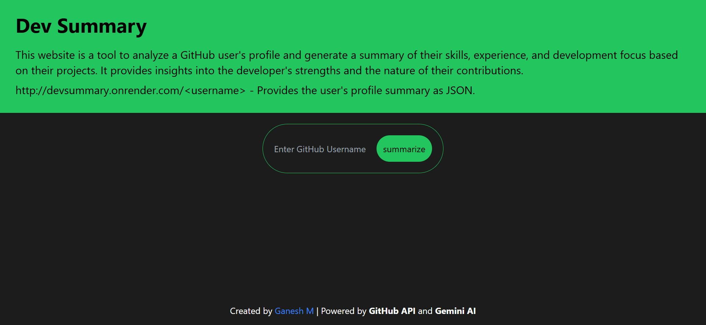
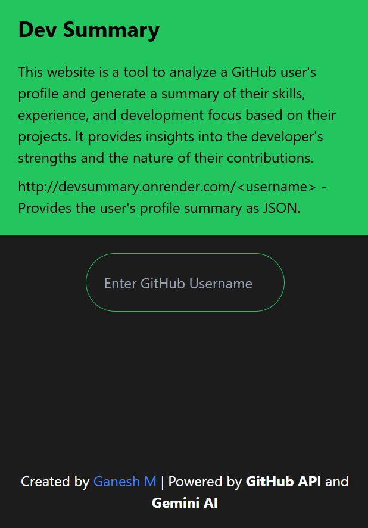

<h1 align="center" id="title">Dev Summary</h1>

<p align="center"></p>

<p id="description">Get a brief overview of a developer's repositories skills and README content with our GitHub profile summary tool Dev Summary.</p>

<p align="center"></p>

<h2>🚀 Demo</h2>

[https://devsummary.onrender.com/](https://devsummary.onrender.com/)

<h2>Project Screenshots:</h2>





  
  
<h2>🧐 Features</h2>

Here're some of the project's best features:

*   User-Friendly UI/UX: Intuitive and responsive interface powered by Tailwind CSS and HTMX for seamless interaction.
*   AI-Generated Summary: Provides detailed analysis and insights into developer skills using the Gemini API.
*   JSON API Endpoint: Exposes a RESTful endpoint to fetch the AI-generated summary in JSON format for integration.

<h2>🛠️ Installation Steps:</h2>

<p>1. Clone the Repository</p>

```
git clone https://github.com/prodev717/dev-summary
```

<p>2. Navigate to the cloned directory</p>

```
cd dev-summary
```

<p>3. Install Required Dependencies</p>

```
pip install -r requirements.txt
```

<p>4. Configure Environment Variables By Creating .env File</p>

```
GEMINI_API_KEY=your-gemini-api-key
GITHUB_API_KEY=your-github-api-key
```

<p>5. Start The Server</p>

```
waitress-serve --host 0.0.0.0 --port 8000 main:app
```

<h2>🍰 Contribution Guidelines:</h2>

To contribute first fork the repository and clone it to your local machine. Create a new branch for your changes then make and test your modifications while following the project's coding style. Commit your changes with a clear message and push your branch to your fork. Afterward create a pull request with a description of your changes. Once it’s reviewed it will be merged.

  
  
<h2>💻 Built with</h2>

Technologies used in the project:

*   python
*   flask
*   htmx
*   tailwind CSS

<h2>🛡️ License:</h2>

This project is licensed under the MIT License
